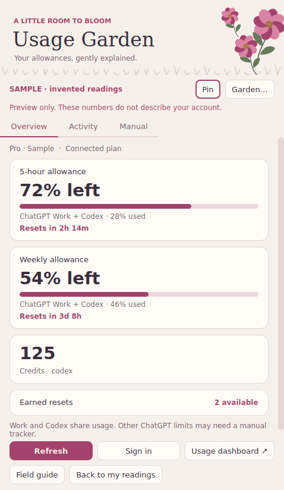

# Usage Garden

**First Bloom · 0.1.0** — a floral Windows desktop widget for understanding your ChatGPT Work and Codex usage.



## Get the Windows app

1. Open this repository's **Actions** tab, choose the latest successful **Build Windows widget** run for `feature/usage-garden-first-bloom` (or `main` after merging), and download **UsageGarden-FirstBloom-0.1.0-Windows-x64** from its Artifacts section. GitHub requires you to be signed in to download Actions artifacts. Artifacts are retained for 90 days; a fresh build creates another download.
2. Right-click the ZIP → **Extract All**. Keep the complete extracted folder together.
3. Double-click **UsageGarden.exe**. No Python or Node installation is needed. The official Codex executable is included.
4. Click **Sign in** and complete OpenAI's sign-in in your browser. Use the same ChatGPT account and workspace whose usage you want to see. If Codex is already signed in, the widget may load that account immediately; check its plan and the official usage dashboard.
5. Optionally run **Install-Usage-Garden.cmd** from the extracted folder to copy the app into your user account and create desktop and Start menu shortcuts. No administrator access is needed.

The build targets **Windows 10/11 x64**. This is an unsigned personal preview; Windows may show an unfamiliar-app notice. Check the repository, build, and source before deciding whether to run it.

If you use GitHub Desktop: fetch and switch to `feature/usage-garden-first-bloom`. The portable download above is the simplest route. **Start-Usage-Garden.cmd** can also run from source with Python 3.11–3.13; it creates a local environment and installs PySide6. Source checkouts need an installed native Codex executable, selected under **Garden…** if it is not found automatically. Do not copy only the EXE out of a portable download: its `_internal` and `vendor` folders are required.

## What it shows

| Reading | Where it comes from |
| --- | --- |
| Remaining percentage and next reset for every returned usage window | Supported Codex `account/rateLimits/read` interface |
| Additional named allowance buckets | The same response, when provided |
| Credits and earned reset count/expiry details | Account response, when provided |
| Lifetime/peak daily token activity, longest turn, streaks, recent daily activity | `account/usage/read`, when supported by your account and Codex version |
| Other ChatGPT model/tool limits | Separate, clearly labeled manual trackers |

Missing values say **Not reported**, never zero or unlimited. Readings are timestamped. Offline or older readings say **Cached**. A passed reset time says **awaiting reading**; the widget never invents a refill. Tokens, credits, and allowances are distinct quantities. It cannot determine a universal number of “messages left” from a percentage.

**ChatGPT Work and Codex share usage.** Ordinary ChatGPT feature counters are not guaranteed to appear in this interface. A Pro plan label does not necessarily identify its exact tier. This widget does not hard-code plan caps, prices, or multipliers.

## Make it yours

- **Garden…**: six palettes (Rosewater, Marigold, Lavender, Sage, Forget-me-not, Moonflower), five flowers (Cosmos, Daisy, Poppy, Tulip, Lavender), and five patterns (Meadow, Pressed flowers, Polka dots, Trellis, Plain).
- **Pin** keeps the window above other apps. **Compact overview** makes it smaller. The window is movable and resizable using standard Windows controls.
- Refresh every 1, 5, or 15 minutes, or only on demand. Countdown labels update every second locally.
- Hover over numbers and labels for definitions; **Field guide** / **F1** contains the full glossary and official documentation links.
- **Preview garden** shows invented example readings without connecting or modifying real usage. Leave preview before editing manual trackers.
- **Activity → Export recorded readings** saves the last 500 successful allowance observations to CSV. This is observed history, not a complete audit of your account.
- **Ctrl+R** refreshes; **Ctrl+Q** exits. Minimizing keeps the app in the taskbar; the tray menu can restore or quit it. Closing the window exits.

## Privacy and boundaries

Usage Garden uses the documented Codex app-server over local standard input/output. It never starts a model turn, reads conversation histories, consumes earned resets, buys credits, or sends messages. It does not scrape browser cookies or read Codex's credential files. Codex manages the OpenAI login and its normal credential storage.

The widget stores selected settings, manual trackers, sanitized numeric observations, and up to 500 historical readings in **`%LOCALAPPDATA%\UsageGarden\settings.json`**. It does not store your email, access tokens, raw RPC responses, or opaque reset-credit IDs. The app has no analytics. Its bundled Codex component follows Codex's own configuration and service behavior. Uninstall by closing the app and deleting `%LOCALAPPDATA%\Programs\UsageGarden` and the two shortcuts; delete the separate data folder only if you also want to erase your readings. Shared Codex sign-in is not removed.

## Develop and verify

```powershell
py -3.12 -m venv .venv
.venv\Scripts\python -m pip install -r requirements.txt
.venv\Scripts\python -m usage_garden --demo
.venv\Scripts\python -m unittest discover -s tests -v
```

Build on Windows with `python -m pip install pyinstaller==6.12.0`, then `python scripts/build_windows.py`. The workflow checks data handling, local RPC, and the native interface; packages the app; verifies a real handshake with the bundled Codex process; and launches the packaged EXE to render a screenshot. Authentication and actual account entitlements require testing on your Windows account. Preview tests never sign in or start an AI task.

The UI also runs on Linux with PySide6 for development. `python -m usage_garden --demo --data-dir /tmp/garden-demo --screenshot docs/preview.png` renders an offscreen preview. `--offline` prevents connection attempts. Normal use permits only one instance per data directory.

See [docs/usage-guide.md](docs/usage-guide.md) for a short explanation of caps, refreshes, resets, and data coverage, and [THIRD_PARTY_NOTICES.md](THIRD_PARTY_NOTICES.md) for component licenses.

## Official sources

Documentation checked September 12, 2026:

- [OpenAI: Pricing and usage](https://developers.openai.com/codex/pricing)
- [OpenAI: Codex app-server account interface](https://learn.chatgpt.com/docs/app-server)
- [OpenAI: Get started with ChatGPT Work](https://learn.chatgpt.com/docs/get-started-with-work)

Usage Garden is an independent utility, not an official OpenAI product. The app-server interface evolves; unavailable optional fields remain explicit rather than being guessed.
